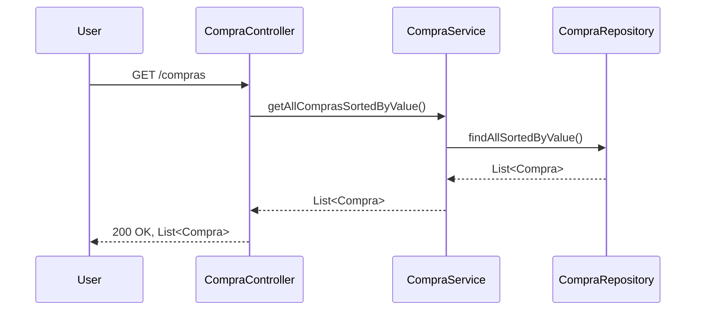
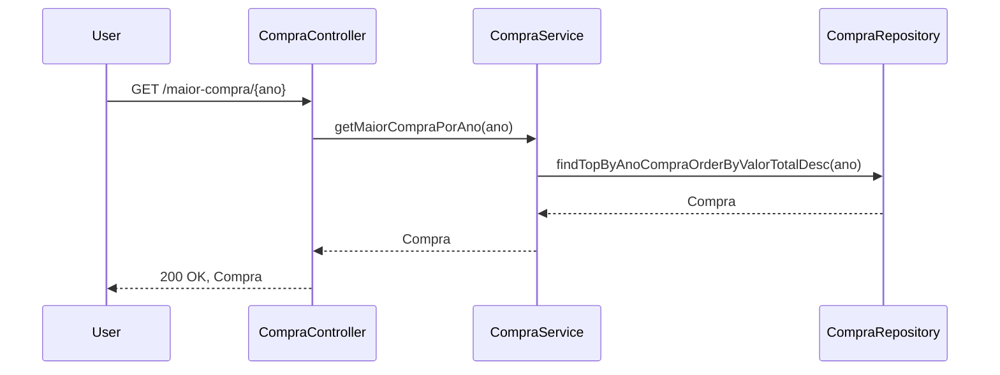
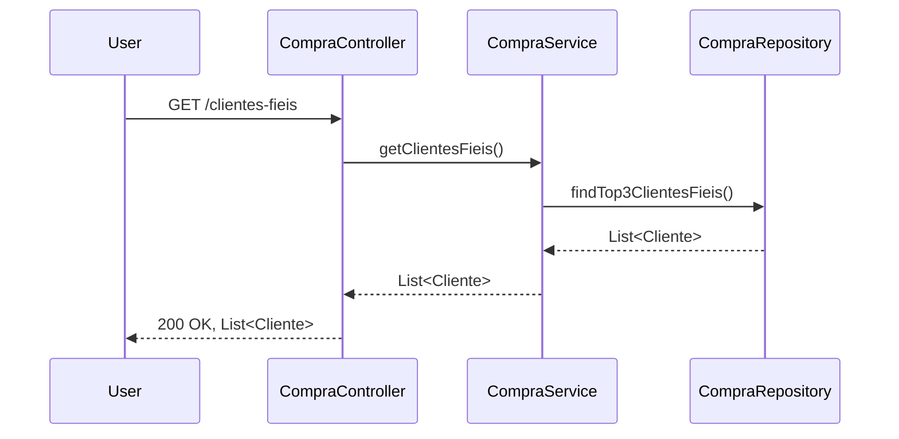
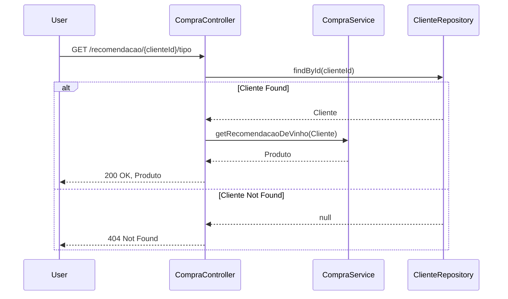

## Teste Digio Compras

### Requisitos
Microserviço com os seguintes endpoints após consumir os dados dos mocks acima e retorne o que está sendo solicitado:

1. `GET: /compras` - Retornar uma lista das compras ordenadas de forma crescente por valor, deve conter o nome dos clientes, cpf dos clientes, dado dos produtos, quantidade das compras e valores totais de cada compra.
2. `GET: /maior-compra/ano` - (Exemplo: /maior_compra/2016) - Retornar a maior compra do ano informando os dados da compra disponibilizados, deve ter o nome do cliente, cpf do cliente, dado do produto, quantidade da compra e seu valor total.
3. `GET: /clientes-fieis` - Retornar o Top 3 clientes mais fieis, clientes que possuem mais compras recorrentes com maiores valores.
4. `GET: /recomendacao/cliente/tipo` - Retornar uma recomendação de vinho baseado nos tipos de vinho que o cliente mais compra.

### Detalhes da Implementação

O microserviço foi implementado com Springboot utilizando os recursos end-to-end desde o web controllers até a persistência de dados.
Os dados sǎo persistidos em uma base de dados H2 em memória, ou seja, os dados persistidos são efêmeros e vão desaparecer ao término da app. 

*O ciclo de vida da app está descrito abaixo:*

1. Inicializar o app - criar o banco de dados, mapear endpoints
2. App inicializada
3. O Listener do Springboot `com.gx2.digio.gyowanny.compras.config.AppStartupListener` é disparado e
  3.1 chama `com.gx2.digio.gyowanny.compras.loader.DataLoader` para carregar os dados dos endpoints, transforma-los e persisti-los na base de dados.
4. API pronta para receber requisições

Os endpoints estão implementados na classe `com.gx2.digio.gyowanny.compras.controller.CompraController`.

#### `/compras`

#### `/maior-compra/{ano}`

#### `/clientes-fieis`

#### `/recomendacao/{clienteId}/tipo`

### Testes Unitários

Foram adicionados cerca de 20 testes unitários que juntos cobrem controller, service e repositórios JPA que possuem queries customizadas.

### O que pode ser melhorado?

#### Segurança da API
- Adicionar mecanismo de autenticaçao baseado em [OAuthX com token tipo JWT](https://oauth.net/2/jwt/) ou
- Considerar a utilizaçao de API Gateway em caso de necessidade de aumento de performance, monitoramento e segurança

#### Job para leitura de dados recorrente
- Transformar o DataLoader em um job que vai chamar os endpoints externos em intervalos pre-programados para manter a base de dados atualizada

#### Banco de Dados e Persistência
- Mudar de persistencia em memoria para persistencia em disco para os dados nao serem mais efêmeros
- Considerar a utilizaçao de cache de dados uma vez que as chamadas a API sao somente para leitura de dados.

### Tecnologias
- Java 21
- Spring Cloud 2023.0.3
  - Spring Boot
  - JPA
  - Actuator
- Banco de dados H2 em memória

